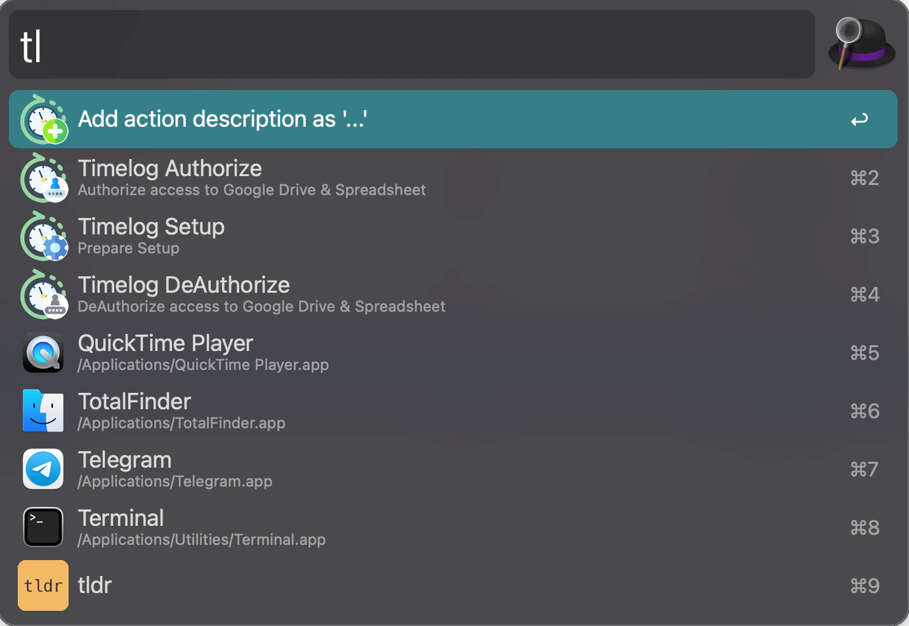
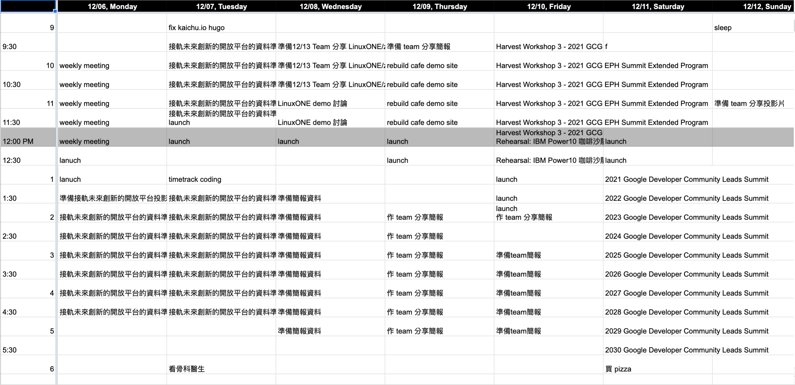
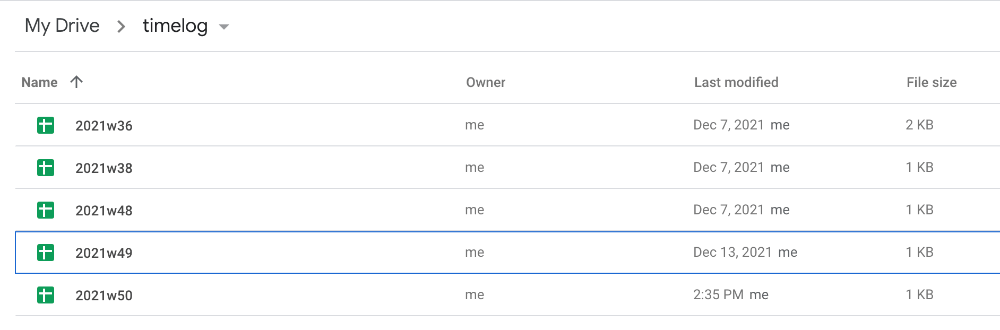
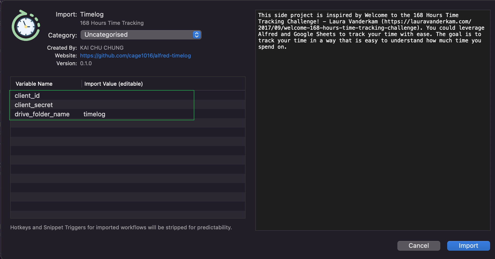

# Timelog alfred workflows

[](https://github.com/cage1016/alfred-timelog/actions/workflows/release.yml)
[](https://img.shields.io/github/v/release/cage1016/alfred-timelog)

This side project is inspired by [Welcome to the 168 Hours Time Tracking Challenge! - Laura Vanderkam](https://lauravanderkam.com/2017/09/welcome-168-hours-time-tracking-challenge/). You could leverage Alfred and Google Sheets to track your time with ease. The goal is to track your time in a way that is easy to understand how much time you spend on.

## 168 Hours Time Tracking Challenge Sheet


## alfred-timelog 








## Usage 

|Command|Explanation|
|--|--|
|tl auth| OAuth alfred-timelog to access your Google Drive and SpreadSheet by Google API (provide your own `client_id` & `client_secret`)|
|tl setup| Create Drive folder and weekly Spreadsheet|
|tl deauth| Revoke access token|
|tl | log action description you want to add to Spreadsheet|


## Installation

1. Visit [Google Cloud Platform Console](https://console.cloud.google.com/) and create new project.

1. Enable Google Drive API and Google Sheets API via `gcloud` command or GCP console.
    ```
    $ gcloud services enable drive.googleapis.com
    $ gcloud services enable sheets.googleapis.com
    ```
1. In the Cloud Console, go to the [Credentials](https://console.cloud.google.com/apis/credentials) page.
1. Click **CREATE_CREDENTIALS**, then select **OAuth client ID**.
1. Select **Web application** application type
1. Set Name as **Alfred Timelog**
1. At Authorized redirect URIs session Click **ADD URI** and set **https://localhost:38146**
1. Click **CREATE** and save `Client ID` and `Client secret` for using later
1. Visit [Releases · cage1016/alfred-timelog](https://github.com/cage1016/alfred-timelog/releases) Download latest release and install.
1. Setup `Client ID` and `Client secret`
    
1. `tl auth` to authorize **alfred-timelog** to access your Google Drive and SpreadSheet by Google API
1. `tl setup` to create Drive folder and weekly Spreadsheet
1. `tl` to add action description you want and will add to Spreadsheet

## Contribute
If you find any bug or want to propose a new feature, please open an issue to discuss it.

## License
This repository contains free software released under the MIT Licence. Please check out the [LICENSE](./LICENSE) file for details.
