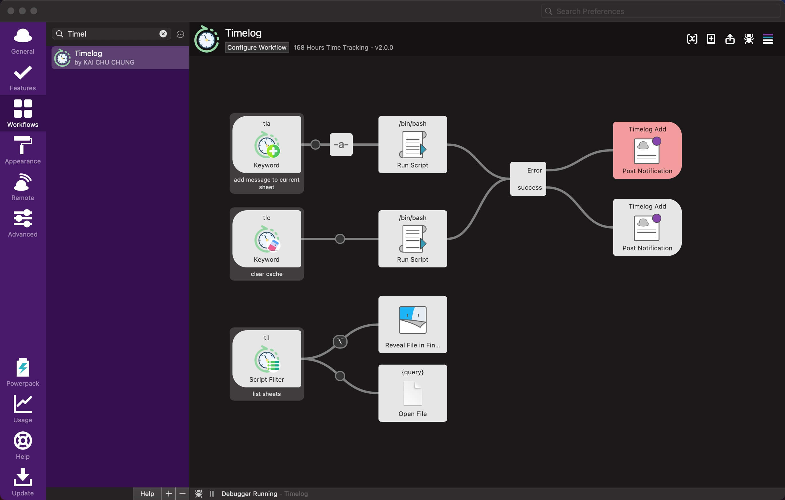

# Timelog alfred workflows

Track your time with Alfred

This side project is inspired by [Welcome to the 168 Hours Time Tracking Challenge! - Laura Vanderkam](https://lauravanderkam.com/2017/09/welcome-168-hours-time-tracking-challenge/). You could leverage Alfred and Google Sheets to track your time with ease. The goal is to track your time in a way that is easy to understand how much time you spend on.

## 168 Hours Time Tracking Challenge Sheet

## Features

- Track your time with Alfred

## Download
Make sure to download the latest released directly from the releases page. [Download here](https://github.com/cage1016/alfred-timelog/releases).

## Requires
- Preferably Alfred 5

## Usage 

- use `tla` to add message to track sheet
- use `tll` to list tracking sheet
- use `tlc` to clear cache

### Track sheet example

## Third Party Library

- [qax-os/excelize: Go language library for reading and writing Microsoft Excel™ (XLAM / XLSM / XLSX / XLTM / XLTX) spreadsheets](https://github.com/qax-os/excelize)

## Change Log

### 2.0.0
- Add alfred5 support
- rewrite by [cage1016/ak](https://github.com/cage1016/ak)
- Save track sheet in local desk instead of Google Spreadsheet to reduce the complexity of setting up

### 1.0.0
- Initial release

## Contribute
If you find any bug or want to propose a new feature, please open an issue to discuss it.

## License
This repository contains free software released under the MIT Licence. Please check out the [LICENSE](./LICENSE) file for details.
